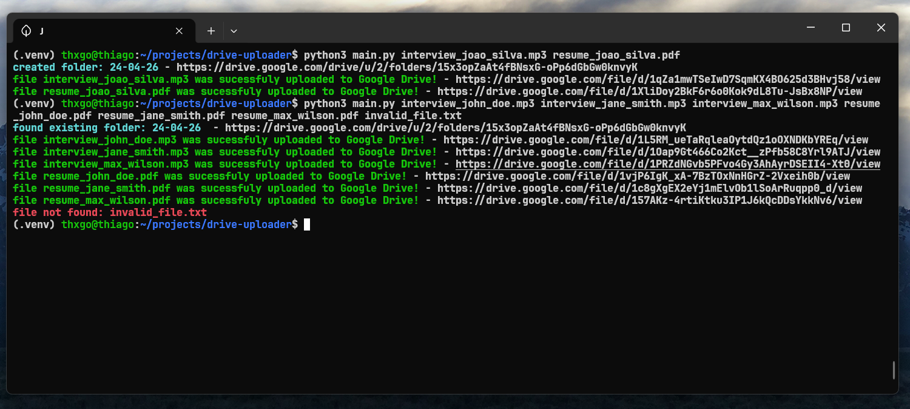
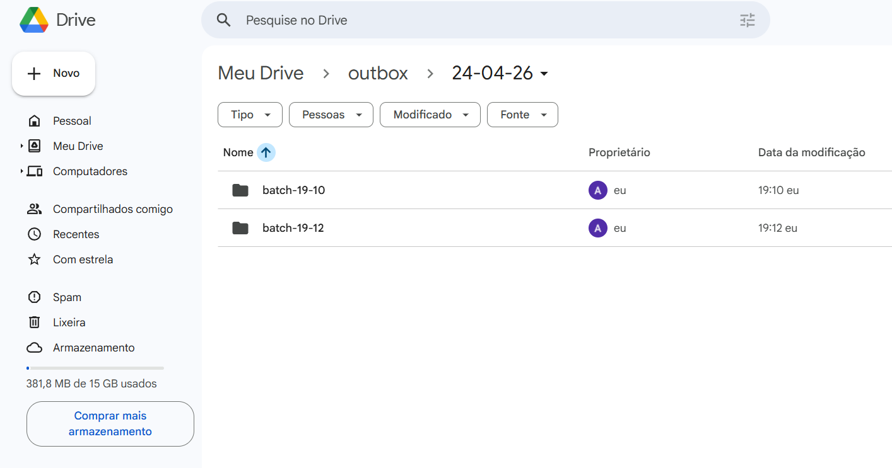

# drive-uploader

A CLI tool that uploads files to Google Drive, automatically organizing them by date and batch, and returns a public shareable link for each file.


 

## How it works

Each time you run the script, it:

1. Authenticates with your Google Drive account via OAuth2
2. Creates (or reuses) a folder for today's date inside your configured outbox folder
3. Creates a batch folder with the current timestamp inside the daily folder
4. Uploads all provided files to that batch
5. Sets each file's visibility to public and returns the shareable link

The folder structure looks like this:

```
outbox/
└── 22-04-26/
    └── batch-19-30/
        ├── video.mp4
        └── audio.mp3
```

## Requirements

- Python 3.12+
- A Google account
- A Google Cloud project with the Drive API enabled

## Setup

### 1. Google Cloud Console

- Go to [console.cloud.google.com](https://console.cloud.google.com)
- Create a new project
- Enable the **Google Drive API** under APIs & Services → Library
- Go to APIs & Services → Credentials → Create Credentials → **OAuth 2.0 Client ID**
- Set application type to **Desktop app**
- Download the JSON file and save it as `credentials.json` in the project root
- Go to **APIs & Services → OAuth consent screen → Audience**
- Add your Google account email as a test user

### 2. Google Drive

Create a folder in your Google Drive where the uploads will be organized. Copy its ID from the URL:

```
https://drive.google.com/drive/folders/THIS_IS_THE_ID
```

### 3. Project configuration

Clone the repository and set up the environment:

```bash
git clone https://github.com/thxgo/drive-uploader
cd drive-uploader
python3 -m venv .venv
source .venv/bin/activate
pip install -r requirements.txt
```

Open `drive/folders.py` and set your folder ID:

```python
OUTBOX_FOLDER_ID = "your_folder_id_here"
```

Place your `credentials.json` in the project root.

### 4. First run

On the first run, a browser window will open asking you to authorize the app with your Google account. After that, a `token.json` file is saved locally and reused in future runs.

## Usage

```bash
python3 main.py file1.mp4 file2.jpg file3.pdf
```

Each file gets its own public link printed to the terminal:

```
created folder: 22-04-26 - https://drive.google.com/drive/folders/...
file video.mp4 was successfully uploaded to Google Drive - https://drive.google.com/file/d/.../view
file audio.mp3 was successfully uploaded to Google Drive - https://drive.google.com/file/d/.../view
```

## Security

Never commit the following files (they are already in `.gitignore`):

- `credentials.json` - your OAuth client secret
- `token.json` - your authenticated session token
- `drive/folders.py` (local copy) - contains your folder ID

Use `main.example.py` and the template files as reference for sharing the project without exposing sensitive data.

## Known limitations

- The app must be in Google's test mode unless submitted for verification, only added test users can authenticate
- OAuth2 tokens may expire and require re-authentication by deleting `token.json` and running the script again

## Stack

- Python 3.12
- Google Drive API v3
- OAuth2 via `google-auth-oauthlib`

